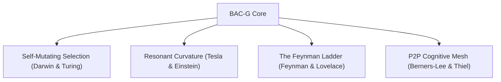

# Innovation Plan: Cognitive Core v6.0 & The Biomorphic Autonomous Code-Genome (BAC-G)

This plan outlines the architectural leap from a static neuromorphic database to a living, self-evolving, self-healing biomorphic codebase substrate. We combine the first-principles methodologies of 14 history-defining thinkers to build a system that goes beyond "tools" and moves into pure, zero-friction code intelligence.

---

## The Vision: Biomorphic Autonomy

Modern software development separates code (the static text), runtime (the execution), and memory (external databases/docs). 

The **BAC-G (Biomorphic Autonomous Code-Genome)** collapses these three layers. The codebase becomes a self-optimizing, self-repairing organic network that automatically shapes context, refactors itself based on evolutionary survival metrics, and visualizes logic as energy currents.

---

## The Thinkers' Framework

### 1. Charles Darwin & Alan Turing: Self-Mutating Evolutionary Selection
* **Concept**: Codebases shouldn't be static. They should evolve.
* **Implementation**: A background sandboxed genetic compiler. When the workspace is idle, the system forks the current code branch, applies structural mutations (refactoring patterns, algorithm swaps, dependency upgrades), runs the test suite, and selects the version with the highest **Fitness Score** (execution speed, low memory overhead, structural simplicity). Fittest mutations are proposed as direct merges.

### 2. Richard Feynman & Ada Lovelace: The Feynman Abstraction Ladder
* **Concept**: Explaining complexity through structured simplicity and mathematical poetry.
* **Implementation**: Memory consolidation dynamically scales across 5 levels of abstraction (PhD, Engineer, Manager, 10-year-old, Analogy). If the context window is crowded, the system compresses historical context files into higher-level, highly dense metaphors (e.g., "acts as a digital post office") rather than raw text.

### 3. Nikola Tesla & Pythagoras: Resonant Curvature & Geometric UI
* **Concept**: Logical structures are harmonious shapes; interactions are electrical currents.
* **Implementation**: We build a WebGL-based **3D Resonance View** inside the editor side-panel. Code files are mapped as stars whose sizes are proportional to their gravity (size + edit count + bug rate). Connecting lines are axons. Editing a file sends visible electrical pulses down the call path, showing developers exactly where side effects will propagate.

### 4. Tim Berners-Lee & Peter Thiel: The Peer-to-Peer Cognitive Mesh
* **Concept**: Distribute truth across networks while preserving private competitive moats.
* **Implementation**: Secure, local-first memory sync. If you run multiple projects (e.g., a Flutter app and a Node.js backend), the memory substrate syncs learnings, environment setup quirks, and package fixes across projects without leaking intellectual property.

---

## Proposed Changes

### [Core Memory & Schema Evolution]

We will upgrade the SQLite memory engine to support biomorphic mutations, genetic history tracking, and hierarchical Feynman compression.

#### [MODIFY] [owl_memory_v5.js](file:///c:/Users/shiva/hermes-custom-mcps/owl_memory_v5.js)
* **Upgrade**: Add handlers for `mutate_code`, `consolidate_feynman`, and `get_resonance_coordinates`.
* **Logic**: Implement the mathematical formula for spreading resonance energy and spatial decay.

#### [NEW] [owl_biomorph.js](file:///c:/Users/shiva/hermes-custom-mcps/owl_biomorph.js)
* **Function**: The sandboxed genetic mutation engine. It reads codebase files, applies AST refactorings using Babel/Esprima, runs tests in a separate worker thread, and returns the fittest branch modifications.

#### [NEW] [resonance_ui.html](file:///c:/Users/shiva/hermes-custom-mcps/resonance_ui.html)
* **Function**: A highly optimized Three.js WebGL visualization. Displays the codebase as a dynamic gravity field, animating electrical resonance propagation in real-time as file changes are perceived.

---

## Verification Plan

### Automated Tests
- `node test_v6_cognitive.js`: Execute cognitive integration tests verifying Feynman compression scales and synaptic resonance flows.
- `node test_biomorph.js`: Validate the genetic mutation engine's sandbox boundary, verifying mutated branches do not corrupt the active branch unless approved.

### Manual Verification
1. Open the interactive `resonance_ui.html` in a browser window.
2. Edit `owl_memory.js` and verify the WebGL visualization pulses energy through connected nodes.
