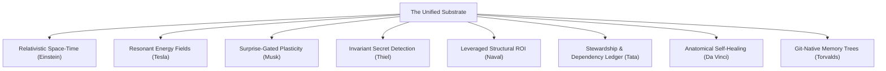

# The Ultimate Neuromorphic Substrate (UNS): A Zero-Tool Memory Engine

This document outlines the architectural blueprint for the next generation of code intelligence. Guided by the principle that **perfection is reached not when there is nothing more to add, but when there is nothing left to remove**, we define a system where memory, call graphs, version control, and execution feedback collapse into a single self-evolving substrate.

---

## 1. The Zen of Zero-Tooling: Why Tool-Calling is a Flaw

In modern AI agent frameworks, memory is treated as an external database. The agent must pause, invoke a tool (e.g., `recall` or `search`), wait for the database response, and then resume execution. This introduces latency, wastes context tokens, and relies on the LLM to actively decide when it needs to remember.

In the human brain, **memory is not a separate queryable database**. Memory is the very structure of the neural network itself. Signals propagate through existing pathways, automatically activating associated context.

**The UNS Vision**: Remove the `recall` and `remember` tools entirely. As the agent interacts with the workspace, the system automatically injects relevant context directly into the prompt pre-fills, using spreading activation across the call graph and git history. The agent never has to "think" about using memory; it simply perceives it.

---

## 2. Thinkers' Council: The 8 Pillars of UNS

We convened our conceptual council to design the core pillars of the UNS, applying first-principles thinking to the relationship between biological brains and codebase architectures.



### 1. Albert Einstein: Relativistic Code Space-Time (Gravity & Dilation)
*   **Biological Analogue**: Synaptic connections weaken over time (temporal decay) and distance (spatial decay).
*   **The UNS Implementation**: Code gravity. We define a unified metric $G(m)$ representing the gravitational pull of a memory $m$ on the current editing node $n$.
    $$G(m) = \frac{S(m) \cdot E(m)}{(D_{\text{graph}}(n, m_c) + 1)^2 \cdot (T_{\text{now}} - T_{\text{created}} + 1)^\alpha}$$
    Where:
    *   $S(m)$ is the historical salience/importance of the memory (e.g., severity of a bug).
    *   $E(m)$ is the emotional valence/arousal weight (developer frustration caught from error logs).
    *   $D_{\text{graph}}(n, m_c)$ is the call-graph distance between the current node and the memory's linked code node.
    *   $T$ is time, and $\alpha$ is the temporal decay constant.
    *   **Result**: High-gravity memories curve the context window, naturally drawing themselves into the pre-fill without explicit queries.

### 2. Nikola Tesla: Synaptic Graph Resonance (Energy Harmonics)
*   **Biological Analogue**: Action potentials propagate along axonal paths, causing sub-threshold depolarization in nearby dendrites, priming them for activation.
*   **The UNS Implementation**: Edit resonance. When a file is modified, an activation charge $E_0$ is injected into its AST node. This charge flows along the call-graph edges. 
    *   If node A calls node B, energy propagates to B.
    *   If node A defines class C, energy propagates to C.
    *   Any memory linked to a node whose activation exceeds a resonance threshold $\theta$ is instantly depolarized and loaded into the active context cache.

### 3. Elon Musk: First-Principles Simulation (Surprise-Gated Plasticity)
*   **Biological Analogue**: Neuromodulators like Acetylcholine (ACh) spike during prediction errors, opening synaptic gates for immediate long-term write operations.
*   **The UNS Implementation**: Closed-loop execution capture. The system intercepts the shell output. If a command or test crashes, the surprise score is calculated based on the branch state:
    $$\text{Surprise} = 1.0 - P(\text{Failure} \mid \text{Branch})$$
    *   A crash on the `main` branch with passing tests generates maximum write-salience.
    *   The system parses the stack trace, identifies the target function, and binds the crash memory to that function.

### 4. Peter Thiel: Invariant Code Secrets (Contra-Analysis)
*   **Biological Analogue**: The brain's default mode network constantly runs contrastive learning to find hidden patterns and anomalies in sensory data.
*   **The UNS Implementation**: The system compares developer documentation/comments against actual git commit histories and execution traces. 
    *   If comments state: `"Function X is thread-safe"`, but the database catches race condition logs or lock-contention git commits, the system flags the contradiction as a "Code Secret" (unwritten truth of the codebase) and alerts the agent during refactoring.

### 5. Naval Ravikant: Leveraged Structural ROI (Friction Elimination)
*   **Biological Analogue**: The brain automates frequent patterns into the basal ganglia (procedural habits) to free up cortical space.
*   **The UNS Implementation**: Cognitive leverage. UNS monitors which functions or files show the highest edit-to-bug ratio (hotspots) in the memory ledger. 
    *   Instead of suggesting generic refactoring, it shows the developer the precise functional neighborhoods causing the most cognitive drag, maximizing leverage per line of code rewritten.

### 6. Ratan Tata: Vendor Stewardship Ledger (Dependency Reliability)
*   **Biological Analogue**: Immune systems maintain memory cells to identify external pathogens and determine response levels.
*   **The UNS Implementation**: Package reliability ledger. UNS intercepts and profiles all third-party package behaviors.
    *   It records npm/pip install times, build warnings, runtime exceptions, and security alerts.
    *   It computes a local "Stewardship Score" for every dependency, warning the agent if it proposes using a library with a history of instability in the local environment.

### 7. Leonardo da Vinci: Anatomical Self-Healing Call Paths
*   **Biological Analogue**: Neuroplasticity allows the brain to reroute signals around damaged tissue.
*   **The UNS Implementation**: Organic code structure. UNS visualizes call paths not as flat graphs, but as biological systems:
    *   *Circulatory*: Data pipelines and state streams.
    *   *Nervous*: Event handlers and listeners.
    *   *Skeletal*: Class hierarchies and schemas.
    *   When a test fails at a node, the system traces the call chain backwards (circulatory flow) to suggest alternative paths or mock interfaces, effectively "healing" the pipeline.

### 8. Linus Torvalds: Git-Native Memory Trees
*   **Biological Analogue**: Memory consolidation maps experiences to temporal contexts (episodic indexing).
*   **The UNS Implementation**: Git branch context isolation. Memories are stored alongside the active Git branch and commit SHA.
    *   Switching branches instantly shifts the memory filter. Memories from unrelated branches are hidden to prevent context poisoning.
    *   Merging branches merges their associated memories, resolving conflicts using semantic vector similarities.

---

## 3. The Unified SQLite Schema

To reduce database bloat and achieve pure structural efficiency, we compress all codebase structures, git metadata, and neuromorphic states into a single unified SQLite database schema.

```sql
-- Core memories table (Episodic, Semantic, Procedural, Somatic)
CREATE TABLE IF NOT EXISTS unified_memories (
    id TEXT PRIMARY KEY,
    content TEXT NOT NULL,
    memory_type TEXT CHECK(memory_type IN ('episodic', 'semantic', 'procedural', 'somatic')),
    created_at TIMESTAMP DEFAULT CURRENT_TIMESTAMP,
    project TEXT DEFAULT 'default',
    salience REAL DEFAULT 0.5,
    emotional_valence REAL DEFAULT 0.0, -- Frustration/satisfaction balance (-1.0 to 1.0)
    access_count INTEGER DEFAULT 1,
    last_accessed TIMESTAMP DEFAULT CURRENT_TIMESTAMP
);

-- Code AST nodes (Files, Classes, Functions)
CREATE TABLE IF NOT EXISTS code_nodes (
    id TEXT PRIMARY KEY, -- filepath::type::name
    name TEXT NOT NULL,
    node_type TEXT CHECK(node_type IN ('file', 'class', 'function')),
    filepath TEXT NOT NULL,
    project TEXT DEFAULT 'default'
);

-- Call graph edges and association links
CREATE TABLE IF NOT EXISTS call_edges (
    source_id TEXT,
    target_id TEXT,
    edge_type TEXT CHECK(edge_type IN ('defines', 'imports', 'calls', 'references')),
    PRIMARY KEY(source_id, target_id),
    FOREIGN KEY(source_id) REFERENCES code_nodes(id) ON DELETE CASCADE,
    FOREIGN KEY(target_id) REFERENCES code_nodes(id) ON DELETE CASCADE
);

-- Spreading activation energy and synaptic weights
CREATE TABLE IF NOT EXISTS synaptic_network (
    source_node_id TEXT,
    target_node_id TEXT,
    weight REAL DEFAULT 1.0,
    last_used TIMESTAMP DEFAULT CURRENT_TIMESTAMP,
    PRIMARY KEY(source_node_id, target_node_id),
    FOREIGN KEY(source_node_id) REFERENCES code_nodes(id) ON DELETE CASCADE,
    FOREIGN KEY(target_node_id) REFERENCES code_nodes(id) ON DELETE CASCADE
);

-- Links connecting memories directly to code structures
CREATE TABLE IF NOT EXISTS memory_code_links (
    memory_id TEXT,
    code_node_id TEXT,
    link_type TEXT CHECK(link_type IN ('caused_bug', 'implemented_by', 'refactored_in', 'documented_by')),
    PRIMARY KEY(memory_id, code_node_id),
    FOREIGN KEY(memory_id) REFERENCES unified_memories(id) ON DELETE CASCADE,
    FOREIGN KEY(code_node_id) REFERENCES code_nodes(id) ON DELETE CASCADE
);

-- Git context binding
CREATE TABLE IF NOT EXISTS git_context (
    memory_id TEXT,
    branch_name TEXT,
    commit_sha TEXT,
    PRIMARY KEY(memory_id, branch_name),
    FOREIGN KEY(memory_id) REFERENCES unified_memories(id) ON DELETE CASCADE
);
```

---

## 4. Implementation Steps: Making it the "Only Tool Needed"

To make OWL Memory the only tool ever needed, we will eliminate the manual tool-calling loop:

1.  **Context Pre-filling (Auto-Injection)**: Integrate the spreading activation query directly into the agent's initialization hook. When the agent receives a prompt, the system queries the active code nodes, propagates energy, pulls high-gravity memories, and inserts them into the system instruction pre-fill.
2.  **Autonomous Error Harvesting**: Set up a background shell listener that catches terminal exits, parses trace failures, and populates the database without developer intervention.
3.  **Visual Graph feedback**: Render the anatomical D3.js visualization inside the developer's side panel, showing active energy waves pulsing through the call graph in real-time as they edit code.
