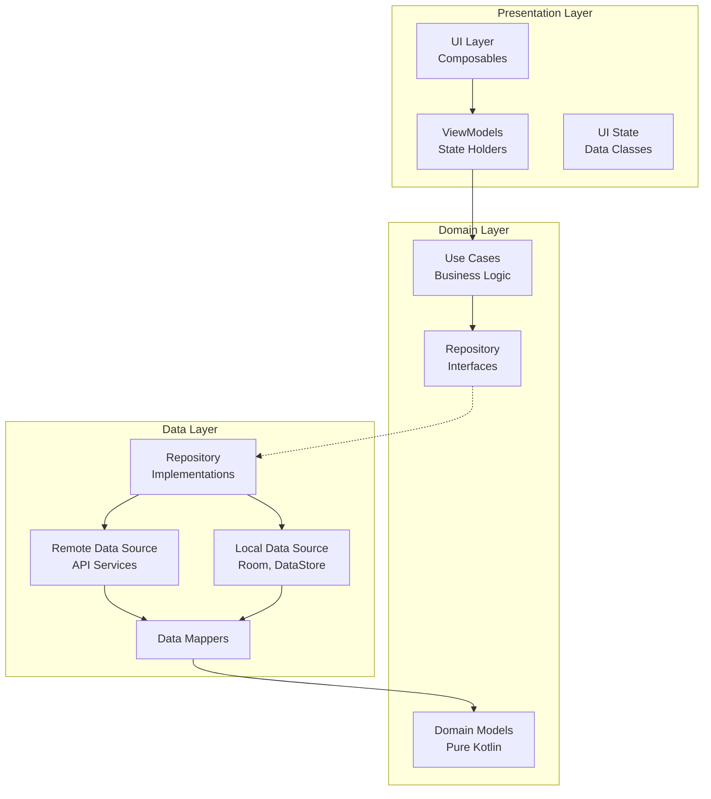

# Android Architecture
## Public Finance Intelligence Platform

**Version**: 1.0  
**Derived From**: [PRD.md](./PRD.md), [InformationArchitecture.md](./InformationArchitecture.md), [DesignSystem.md](./DesignSystem.md)  
**Status**: Approved

---

## 1. Technology Stack

### 1.1 Core Technologies

| Component | Technology | Version | Rationale |
|-----------|------------|---------|-----------|
| Language | Kotlin | 2.0+ | Official Android language, null safety, coroutines |
| UI Framework | Jetpack Compose | 1.6+ | Declarative UI, modern, less boilerplate |
| Architecture | MVVM + Clean Architecture | - | Separation of concerns, testability |
| DI | Hilt | 2.50+ | Official Android DI, compile-time safety |
| Navigation | Navigation Compose | 2.7+ | Type-safe navigation, deep linking |
| Local DB | Room | 2.6+ | SQLite abstraction, coroutine support |
| Networking | Retrofit + OkHttp | 2.11+ | Industry standard, interceptors |
| Async | Kotlin Coroutines + Flow | 1.8+ | Structured concurrency, backpressure |
| Image Loading | Coil | 2.6+ | Kotlin-native, Compose integration |
| JSON | kotlinx.serialization | 1.6+ | Kotlin multiplatform, performance |

### 1.2 Additional Libraries

```kotlin
// Testing
- JUnit 5
- MockK
- Turbine (Flow testing)
- Compose UI Testing

// Quality
- Detekt (linting)
- Ktlint (formatting)
- Jacoco (coverage)

// Utilities
- Timber (logging)
- DataStore (preferences)
- WorkManager (background tasks)
- App Startup (initialization)
- Lifecycle (process death handling)
```

---

## 2. Architecture Overview

### 2.1 Layered Architecture



### 2.2 Module Structure

```
app/
├── build.gradle.kts
└── src/

feature-*/
├── budget-explorer/
├── search/
├── scheme-detail/
├── alerts/
└── settings/

core-*/
├── core-ui/           # Shared UI components
├── core-data/         # Shared data layer
├── core-domain/       # Shared domain layer
├── core-network/      # Network configuration
├── core-database/     # Database setup
├── core-analytics/    # Analytics tracking
└── core-testing/      # Testing utilities

build-logic/
├── convention/        # Gradle convention plugins
└── settings/          # Settings plugin
```

---

## 3. Folder Structure

### 3.1 Standard Feature Module Structure

```
feature-budget-explorer/
├── build.gradle.kts
├── proguard-rules.pro
└── src/
    ├── main/
    │   ├── java/com/publicfinance/feature/budgetexplorer/
    │   │   ├── BudgetExplorerScreen.kt          # Main composable
    │   │   ├── BudgetExplorerViewModel.kt        # ViewModel
    │   │   ├── BudgetExplorerUiState.kt          # UI state
    │   │   ├── BudgetExplorerEvent.kt            # UI events
    │   │   ├── navigation/
    │   │   │   └── BudgetExplorerNavigation.kt   # Navigation graph
    │   │   ├── components/
    │   │   │   ├── MinistryList.kt
    │   │   │   ├── BudgetChart.kt
    │   │   │   └── YearSelector.kt
    │   │   └── di/
    │   │       └── BudgetExplorerModule.kt       # Hilt module
    │   ├── res/
    │   │   ├── values/
    │   │   │   └── strings.xml
    │   │   └── drawable/
    │   └── AndroidManifest.xml
    └── test/
        └── java/.../
            ├── BudgetExplorerViewModelTest.kt
            └── BudgetExplorerScreenTest.kt
```

### 3.2 App Module Structure

```
app/
├── build.gradle.kts
└── src/
    ├── main/
    │   ├── java/com/publicfinance/owl/
    │   │   ├── OwlApplication.kt              # Application class
    │   │   ├── MainActivity.kt                # Single activity
    │   │   ├── MainActivityViewModel.kt
    │   │   ├── navigation/
    │   │   │   ├── AppNavGraph.kt             # Top-level navigation
    │   │   │   └── ScreenDestinations.kt      # Sealed class destinations
    │   │   └── di/
    │   │       └── AppModule.kt
    │   └── res/
    │       ├── values/
    │       │   ├── strings.xml
    │       │   ├── colors.xml
    │       │   └── themes.xml
    │       ├── values-night/
    │       └── mipmap-*/
    └── test/
```

### 3.3 Core Module Structures

```
core-network/
├── src/main/java/.../core/network/
│   ├── HttpClientFactory.kt           # OkHttp configuration
│   ├── NetworkResult.kt               # Sealed result class
│   ├── ApiConstants.kt                # Base URLs, timeouts
│   ├── interceptor/
│   │   ├── AuthInterceptor.kt
│   │   ├── LoggingInterceptor.kt
│   │   └── OfflineInterceptor.kt
│   └── di/
│       └── NetworkModule.kt

core-database/
├── src/main/java/.../core/database/
│   ├── OwlDatabase.kt                 # Room database
│   ├── dao/
│   │   ├── BudgetDao.kt
│   │   ├── SchemeDao.kt
│   │   └── SearchHistoryDao.kt
│   ├── entity/
│   │   ├── BudgetEntity.kt
│   │   ├── SchemeEntity.kt
│   │   └── CrossRefEntities.kt
│   └── di/
│       └── DatabaseModule.kt

core-domain/
├── src/main/java/.../core/domain/
│   ├── model/
│   │   ├── Budget.kt                  # Pure domain models
│   │   ├── Scheme.kt
│   │   ├── Ministry.kt
│   │   └── MoneyFlow.kt
│   └── repository/
│       ├── BudgetRepository.kt        # Repository interfaces
│       ├── SearchRepository.kt
│       └── UserRepository.kt
```

---

## 4. MVVM Implementation

### 4.1 ViewModel Pattern

```kotlin
@HiltViewModel
class BudgetExplorerViewModel @Inject constructor(
    private val getBudgetsUseCase: GetBudgetsUseCase,
    private val getMinistriesUseCase: GetMinistriesUseCase,
    savedStateHandle: SavedStateHandle
) : ViewModel() {

    private val _uiState = MutableStateFlow(BudgetExplorerUiState())
    val uiState: StateFlow<BudgetExplorerUiState> = _uiState.asStateFlow()

    init {
        loadBudgetData()
    }

    fun onEvent(event: BudgetExplorerEvent) {
        when (event) {
            is BudgetExplorerEvent.SelectYear -> selectYear(event.year)
            is BudgetExplorerEvent.SelectMinistry -> navigateToMinistry(event.ministryId)
            BudgetExplorerEvent.Refresh -> refreshData()
        }
    }

    private fun loadBudgetData() {
        viewModelScope.launch {
            _uiState.update { it.copy(isLoading = true) }
            
            getBudgetsUseCase()
                .catch { e -> 
                    _uiState.update { 
                        it.copy(
                            isLoading = false,
                            error = e.toUiError()
                        ) 
                    }
                }
                .collect { budgets ->
                    _uiState.update {
                        it.copy(
                            isLoading = false,
                            budgets = budgets,
                            selectedYear = budgets.firstOrNull()?.year
                        )
                    }
                }
        }
    }

    private fun selectYear(year: String) {
        _uiState.update { it.copy(selectedYear = year) }
        // Trigger data reload for selected year
    }

    private fun navigateToMinistry(ministryId: String) {
        // Navigation side effect through event channel
    }
}
```

### 4.2 UI State Pattern

```kotlin
data class BudgetExplorerUiState(
    val isLoading: Boolean = false,
    val isError: Boolean = false,
    val error: UiError? = null,
    val selectedYear: String? = null,
    val budgets: List<BudgetUiModel> = emptyList(),
    val ministries: List<MinistryUiModel> = emptyList(),
    val availableYears: List<String> = emptyList()
)

sealed interface UiError {
    data class NetworkError(val message: String) : UiError
    data class ServerError(val code: Int) : UiError
    object OfflineError : UiError
    object UnknownError : UiError
}

data class BudgetUiModel(
    val id: String,
    val year: String,
    val totalAllocation: String,  // Formatted string
    val totalAllocationRaw: Long, // Raw value for calculations
    val lastUpdated: Instant
)
```

### 4.3 UI Events Pattern

```kotlin
sealed interface BudgetExplorerEvent {
    data class SelectYear(val year: String) : BudgetExplorerEvent
    data class SelectMinistry(val ministryId: String) : BudgetExplorerEvent
    data class FilterBySector(val sector: String) : BudgetExplorerEvent
    object Refresh : BudgetExplorerEvent
    object DismissError : BudgetExplorerEvent
}
```

---

## 5. Repository Pattern

### 5.1 Repository Interface (Domain Layer)

```kotlin
interface BudgetRepository {
    fun getBudgets(): Flow<List<Budget>>
    suspend fun getBudgetByYear(year: String): Result<Budget>
    suspend fun getMinistries(budgetId: String): Result<List<Ministry>>
    suspend fun getSchemeDetails(schemeId: String): Result<Scheme>
    fun getMoneyFlow(schemeId: String): Flow<MoneyFlow>
    
    suspend fun refreshBudgets(): Result<Unit>
    suspend fun clearCache(): Unit
}
```

### 5.2 Repository Implementation (Data Layer)

```kotlin
class BudgetRepositoryImpl @Inject constructor(
    private val remoteDataSource: BudgetRemoteDataSource,
    private val localDataSource: BudgetLocalDataSource,
    private val networkMonitor: NetworkMonitor,
    private val ioDispatcher: Dispatcher = Dispatchers.IO
) : BudgetRepository {

    override fun getBudgets(): Flow<List<Budget>> = flow {
        if (!networkMonitor.isOnlineOrUnknown()) {
            // Offline: emit cached data only
            emitAll(localDataSource.getBudgets())
        } else {
            // Online: try network first, fallback to cache
            remoteDataSource.getBudgets()
                .onSuccess { budgets ->
                    localDataSource.cacheBudgets(budgets)
                    emit(budgets)
                }
                .onFailure {
                    // Fallback to cache on error
                    emitAll(localDataSource.getBudgets())
                }
        }
    }.flowOn(ioDispatcher)

    override suspend fun refreshBudgets(): Result<Unit> = withContext(ioDispatcher) {
        try {
            val budgets = remoteDataSource.fetchBudgets()
            localDataSource.cacheBudgets(budgets)
            Result.success(Unit)
        } catch (e: Exception) {
            Result.failure(e)
        }
    }

    // ... other implementations
}
```

### 5.3 Data Sources

```kotlin
// Remote Data Source
interface BudgetRemoteDataSource {
    suspend fun fetchBudgets(): List<Budget>
    suspend fun fetchMinistries(budgetId: String): List<Ministry>
    suspend fun fetchSchemeDetails(schemeId: String): Scheme
}

class BudgetRemoteDataSourceImpl @Inject constructor(
    private val apiService: BudgetApiService,
    private val mapper: BudgetMapper
) : BudgetRemoteDataSource {
    
    override suspend fun fetchBudgets(): List<Budget> {
        val response = apiService.getBudgets()
        return response.map(mapper::toDomain)
    }
    
    // ... other methods
}

// Local Data Source
interface BudgetLocalDataSource {
    fun getBudgets(): Flow<List<Budget>>
    suspend fun cacheBudgets(budgets: List<Budget>)
    suspend fun clearCache()
}

class BudgetLocalDataSourceImpl @Inject constructor(
    private val dao: BudgetDao,
    private val mapper: BudgetMapper
) : BudgetLocalDataSource {
    
    override fun getBudgets(): Flow<List<Budget>> {
        return dao.getAllBudgets().map { entities ->
            entities.map(mapper::toDomain)
        }
    }
    
    override suspend fun cacheBudgets(budgets: List<Budget>) {
        dao.insertAll(budgets.map(mapper::toEntity))
    }
}
```

---

## 6. Dependency Injection

### 6.1 Hilt Setup

```kotlin
// Application class
@HiltAndroidApp
class OwlApplication : Application()

// AppModule
@Module
@InstallIn(SingletonComponent::class)
object AppModule {

    @Provides
    @Singleton
    fun provideHttpClient(
        @ApplicationContext context: Context,
        authInterceptor: AuthInterceptor,
        loggingInterceptor: HttpLoggingInterceptor,
        offlineInterceptor: OfflineInterceptor
    ): OkHttpClient {
        return OkHttpClient.Builder()
            .addInterceptor(authInterceptor)
            .addInterceptor(loggingInterceptor)
            .addInterceptor(offlineInterceptor)
            .cache(Cache(context.cacheDir, 10 * 1024 * 1024)) // 10MB
            .connectTimeout(30, TimeUnit.SECONDS)
            .readTimeout(30, TimeUnit.SECONDS)
            .writeTimeout(30, TimeUnit.SECONDS)
            .build()
    }

    @Provides
    @Singleton
    fun provideRetrofit(client: OkHttpClient): Retrofit {
        return Retrofit.Builder()
            .baseUrl(ApiConstants.BASE_URL)
            .client(client)
            .addConverterFactory(Json.asConverterFactory("application/json".toMediaType()))
            .build()
    }

    @Provides
    @Singleton
    fun provideDatabase(@ApplicationContext context: Context): OwlDatabase {
        return Room.databaseBuilder(
            context,
            OwlDatabase::class.java,
            "owl_database"
        )
            .fallbackToDestructiveMigration() // TODO: Add proper migrations
            .build()
    }

    @Provides
    @Singleton
    fun provideDispatcher(): Dispatcher = Dispatchers.IO
}
```

### 6.2 Feature Module DI

```kotlin
@Module
@InstallIn(ViewModelComponent::class)
object BudgetExplorerModule {

    @Provides
    fun provideGetBudgetsUseCase(repository: BudgetRepository): GetBudgetsUseCase {
        return GetBudgetsUseCase(repository)
    }

    @Provides
    fun provideGetMinistriesUseCase(repository: BudgetRepository): GetMinistriesUseCase {
        return GetMinistriesUseCase(repository)
    }
}
```

---

## 7. Navigation

### 7.1 Type-Safe Navigation

```kotlin
// Screen destinations
sealed class ScreenDestinations(val route: String) {
    object Home : ScreenDestinations("home")
    object Search : ScreenDestinations("search")
    object Explore : ScreenDestinations("explore")
    object Alerts : ScreenDestinations("alerts")
    object Settings : ScreenDestinations("settings")
    
    object SchemeDetail : ScreenDestinations("scheme/{schemeId}") {
        fun createRoute(schemeId: String) = "scheme/$schemeId"
    }
    
    object MinistryDetail : ScreenDestinations("ministry/{ministryId}") {
        fun createRoute(ministryId: String) = "ministry/$ministryId"
    }
    
    object MoneyFlow : ScreenDestinations("moneyflow/{schemeId}") {
        fun createRoute(schemeId: String) = "moneyflow/$schemeId"
    }
}

// Navigation graph
@Composable
fun AppNavGraph(
    navController: NavHostController,
    startDestination: String = ScreenDestinations.Home.route
) {
    NavHost(
        navController = navController,
        startDestination = startDestination
    ) {
        composable(ScreenDestinations.Home.route) {
            HomeScreen(
                onNavigateToSearch = {
                    navController.navigate(ScreenDestinations.Search.route)
                },
                onNavigateToScheme = { schemeId ->
                    navController.navigate(ScreenDestinations.SchemeDetail.createRoute(schemeId))
                }
            )
        }
        
        composable(ScreenDestinations.Search.route) {
            SearchScreen(
                onNavigateToScheme = { schemeId ->
                    navController.navigate(ScreenDestinations.SchemeDetail.createRoute(schemeId))
                },
                onBackClick = { navController.popBackStack() }
            )
        }
        
        composable(
            route = ScreenDestinations.SchemeDetail.route,
            arguments = listOf(navArgument("schemeId") { type = NavType.StringType })
        ) { backStackEntry ->
            val schemeId = backStackEntry.arguments?.getString("schemeId") ?: return@composable
            SchemeDetailScreen(
                schemeId = schemeId,
                onNavigateToMoneyFlow = {
                    navController.navigate(ScreenDestinations.MoneyFlow.createRoute(schemeId))
                },
                onBackClick = { navController.popBackStack() }
            )
        }
        
        // ... more destinations
    }
}
```

### 7.2 Deep Linking

```kotlin
// In navigation graph
composable(
    route = ScreenDestinations.SchemeDetail.route,
    deepLinks = listOf(
        navDeepLink {
            uriPattern = "publicfinance://scheme/{schemeId}"
        },
        navDeepLink {
            uriPattern = "https://publicfinance.in/scheme/{schemeId}"
        }
    )
) {
    // Handle deep link
}

// In AndroidManifest.xml
<intent-filter>
    <action android:name="android.intent.action.VIEW" />
    <category android:name="android.intent.category.DEFAULT" />
    <category android:name="android.intent.category.BROWSABLE" />
    <data android:scheme="publicfinance" />
    <data android:host="scheme" />
</intent-filter>
```

---

## 8. Offline-First Strategy

### 8.1 Network Monitoring

```kotlin
interface NetworkMonitor {
    fun isOnlineOrUnknown(): Boolean
    val networkStatus: StateFlow<NetworkStatus>
}

enum class NetworkStatus {
    ONLINE,
    OFFLINE,
    UNKNOWN
}

@Singleton
class ConnectivityManagerNetworkMonitor @Inject constructor(
    @ApplicationContext private val context: Context
) : NetworkMonitor {

    private val connectivityManager = 
        context.getSystemService<ConnectivityManager>()!!

    override val networkStatus: StateFlow<NetworkStatus> = callbackFlow {
        val callback = object : ConnectivityManager.NetworkCallback() {
            override fun onAvailable(network: Network) {
                trySend(NetworkStatus.ONLINE)
            }
            override fun onLost(network: Network) {
                trySend(NetworkStatus.OFFLINE)
            }
            override fun onUnavailable() {
                trySend(NetworkStatus.UNKNOWN)
            }
        }
        
        connectivityManager.registerDefaultNetworkCallback(callback)
        awaitClose { connectivityManager.unregisterNetworkCallback(callback) }
    }.stateIn(
        scope = CoroutineScope(Dispatchers.IO + SupervisorJob()),
        started = SharingStarted.WhileSubscribed(5000),
        initialValue = NetworkStatus.UNKNOWN
    )

    override fun isOnlineOrUnknown(): Boolean {
        return networkStatus.value != NetworkStatus.OFFLINE
    }
}
```

### 8.2 Work Manager for Sync

```kotlin
// Sync worker
@HiltWorker
class BudgetSyncWorker @AssistedInject constructor(
    @Assisted context: Context,
    @Assisted params: WorkerParameters,
    private val budgetRepository: BudgetRepository
) : CoroutineWorker(context, params) {

    override suspend fun doWork(): Result = withContext(Dispatchers.IO) {
        try {
            budgetRepository.refreshBudgets()
            Result.success()
        } catch (e: Exception) {
            if (runAttemptCount < MAX_RETRIES) {
                Result.retry()
            } else {
                Result.failure()
            }
        }
    }

    companion object {
        const val MAX_RETRIES = 3
        const val WORK_NAME = "budget_sync"
    }
}

// Schedule periodic sync
fun scheduleBudgetSync(context: Context) {
    val syncRequest = PeriodicWorkRequestBuilder<BudgetSyncWorker>(
        repeatInterval = 6,
        repeatIntervalTimeUnit = TimeUnit.HOURS
    )
        .setConstraints(
            Constraints.Builder()
                .setRequiredNetworkType(NetworkType.CONNECTED)
                .setRequiresBatteryNotLow(true)
                .build()
        )
        .setBackoffCriteria(
            BackoffPolicy.EXPONENTIAL,
            WorkRequest.MIN_BACKOFF_MILLIS,
            TimeUnit.MILLISECONDS
        )
        .build()

    WorkManager.getInstance(context).enqueueUniquePeriodicWork(
        BudgetSyncWorker.WORK_NAME,
        ExistingPeriodicWorkPolicy.KEEP,
        syncRequest
    )
}
```

### 8.3 Cache Strategy

```kotlin
// Multi-layer caching
class CachingStrategy @Inject constructor(
    private val memoryCache: LruCache<String, Any>,
    private val diskCache: BudgetDao,
    private val networkMonitor: NetworkMonitor
) {
    
    suspend fun <T> getOrFetch(
        key: String,
        maxAge: Duration = 24.hours,
        fetcher: suspend () -> T
    ): Result<T> {
        // Try memory cache first
        @Suppress("UNCHECKED_CAST")
        memoryCache.get(key)?.let { cached ->
            return Result.success(cached as T)
        }
        
        // Try disk cache
        if (networkMonitor.isOnlineOrUnknown()) {
            val diskData = getFromDisk(key, maxAge)
            if (diskData != null) {
                memoryCache.put(key, diskData)
                return Result.success(diskData)
            }
        }
        
        // Fetch from network
        return try {
            val freshData = fetcher()
            memoryCache.put(key, freshData)
            saveToDisk(key, freshData)
            Result.success(freshData)
        } catch (e: Exception) {
            // Last resort: stale data
            getStaleFromDisk(key)?.let { stale ->
                Result.success(stale)
            } ?: Result.failure(e)
        }
    }
}
```

---

## 9. Testing Strategy

### 9.1 Test Pyramid

```
        /\
       /  \      E2E Tests (5%)
      /----\     (Espresso, UI tests)
     /      \
    /--------\   Integration Tests (15%)
   /          \  (Repository, Use Case tests)
  /------------\ 
 /              \ Unit Tests (80%)
/________________\ (ViewModel, Utility tests)
```

### 9.2 Unit Test Example

```kotlin
@Test
fun `getBudgets emits loading then success when data fetched`() = runTest {
    // Given
    val expectedBudgets = listOf(
        Budget(id = "1", year = "2024-25", totalAllocation = 1248770000000L)
    )
    whenever(budgetRepository.getBudgets()).thenReturn(flowOf(expectedBudgets))
    
    val viewModel = BudgetExplorerViewModel(
        getBudgetsUseCase = GetBudgetsUseCase(budgetRepository),
        savedStateHandle = SavedStateHandle()
    )
    
    // When
    val states = viewModel.uiState.toList()
    
    // Then
    assertTrue(states[0].isLoading) // Initial loading
    assertEquals(expectedBudgets, states[1].budgets) // Success state
}
```

### 9.3 Compose UI Test Example

```kotlin
@Test
fun budgetExplorer_displaysBudgets_whenDataLoaded() {
    composeTestRule.setContent {
        BudgetExplorerScreen(
            uiState = BudgetExplorerUiState(
                isLoading = false,
                budgets = listOf(
                    BudgetUiModel(
                        id = "1",
                        year = "2024-25",
                        totalAllocation = "₹1,24,877 Cr",
                        totalAllocationRaw = 1248770000000L,
                        lastUpdated = Instant.now()
                    )
                )
            ),
            onEvent = {}
        )
    }
    
    composeTestRule
        .onNodeWithText("₹1,24,877 Cr")
        .assertIsDisplayed()
}
```

---

## 10. Code Standards

### 10.1 Naming Conventions

```kotlin
// Classes: PascalCase
class BudgetRepositoryImpl

// Functions/Methods: camelCase
fun getBudgetByYear()

// Properties/Variables: camelCase
private val _uiState = MutableStateFlow(...)

// Constants: SCREAMING_SNAKE_CASE
const val MAX_RETRIES = 3

// Composables: PascalCase (like classes)
@Composable
fun BudgetExplorerScreen()

// Test functions: descriptive backtick names
fun `refresh should call repository when network available`()

// Resources: snake_case
R.string.budget_explorer_title
R.drawable.ic_budget
```

### 10.2 File Organization

```kotlin
// Imports order
import com.publicfinance...           // Project imports
import android...                     // Android imports
import androidx...                    // Support library imports
import org...                         // Third-party imports
import java...                        // Java imports

// Blank line between groups
// Alphabetical within groups
```

### 10.3 Documentation Standards

```kotlin
/**
 * Calculates the total budget allocation for a given ministry.
 *
 * @param ministryId The unique identifier of the ministry
 * @param year The fiscal year in format "YYYY-YY"
 * @return Result containing the total allocation or error
 * @throws ResourceNotFoundException if ministry doesn't exist
 */
suspend fun calculateMinistryTotal(
    ministryId: String,
    year: String
): Result<Long>
```

---

## 11. Performance Optimization

### 11.1 Compose Best Practices

```kotlin
// Use remember for expensive calculations
val sortedBudgets = remember(budgets) {
    budgets.sortedByDescending { it.totalAllocationRaw }
}

// Use derivedStateOf for state derived from other state
val hasUnsavedChanges by derivedStateOf {
    originalData != currentData
}

// Use LaunchedEffect for side effects
LaunchedEffect(schemeId) {
    viewModel.loadSchemeDetails(schemeId)
}

// Use key() for list stability
LazyColumn {
    items(budgets, key = { it.id }) { budget ->
        BudgetCard(budget)
    }
}
```

### 11.2 Memory Management

```kotlin
// Avoid memory leaks with proper scope usage
class MyViewModel @Inject constructor(
    private val repository: Repository
) : ViewModel() {
    
    // Good: Uses viewModelScope
    fun loadData() {
        viewModelScope.launch {
            repository.getData().collect { /* ... */ }
        }
    }
    
    // Bad: Would leak
    // CoroutineScope(Dispatchers.Main).launch { ... }
}

// Clear large resources on low memory
override fun onTrimMemory(level: Int) {
    super.onTrimMemory(level)
    if (level == TRIM_MEMORY_RUNNING_CRITICAL) {
        imageLoader.memoryCache.clear()
    }
}
```

---

## Appendix A: Build Configuration

### Root build.gradle.kts

```kotlin
plugins {
    alias(libs.plugins.android.application) apply false
    alias(libs.plugins.kotlin.android) apply false
    alias(libs.plugins.hilt) apply false
    alias(libs.plugins.compose.compiler) apply false
}
```

### App build.gradle.kts

```kotlin
plugins {
    alias(libs.plugins.android.application)
    alias(libs.plugins.kotlin.android)
    alias(libs.plugins.hilt)
    alias(libs.plugins.compose.compiler)
}

android {
    namespace = "com.publicfinance.owl"
    compileSdk = 34
    
    defaultConfig {
        applicationId = "com.publicfinance.owl"
        minSdk = 26  // Android 8.0
        targetSdk = 34
        versionCode = 1
        versionName = "1.0.0"
        
        vectorDrawables {
            useSupportLibrary = true
        }
    }
    
    buildTypes {
        release {
            isMinifyEnabled = true
            proguardFiles(getDefaultProguardFile("proguard-android-optimize.txt"), "proguard-rules.pro")
        }
    }
    
    compileOptions {
        sourceCompatibility = JavaVersion.VERSION_17
        targetCompatibility = JavaVersion.VERSION_17
    }
    
    kotlinOptions {
        jvmTarget = "17"
    }
    
    buildFeatures {
        compose = true
        buildConfig = true
    }
}

dependencies {
    implementation(project(":feature-budget-explorer"))
    implementation(project(":feature-search"))
    implementation(project(":core-ui"))
    implementation(project(":core-data"))
    
    implementation(platform(libs.androidx.compose.bom))
    implementation(libs.androidx.compose.ui)
    implementation(libs.androidx.compose.material3)
    
    implementation(libs.hilt.android)
    kapt(libs.hilt.compiler)
    
    implementation(libs.androidx.lifecycle.runtimeCompose)
    implementation(libs.androidx.navigation.compose)
}
```

---

*This Android Architecture document is derived from PRD.md, InformationArchitecture.md, and DesignSystem.md. All Android implementation must follow these patterns and standards.*
