# Information Architecture
## Public Finance Intelligence Platform

**Version**: 1.0  
**Derived From**: [PRD.md](./PRD.md), [Vision.md](./Vision.md)  
**Status**: Approved

---

## 1. Site Map

```mermaid
graph TD
    A[Public Finance Platform] --> B[Mobile App]
    A --> C[Web App]
    A --> D[API Platform]
    
    B --> B1[Splash Screen]
    B --> B2[Onboarding Flow]
    B --> B3[Home Dashboard]
    B --> B4[Search]
    B --> B5[Budget Explorer]
    B --> B6[Alerts Center]
    B --> B7[Settings & Profile]
    
    B3 --> B3a[Your Constituency Card]
    B3 --> B3b[Recent Searches]
    B3 --> B3c[Trending Schemes]
    B3 --> B3d[Quick Actions]
    
    B4 --> B4a[Search Results]
    B4 --> B4b[Search Filters]
    B4 --> B4c[Search History]
    
    B5 --> B5a[Union Budget Overview]
    B5 --> B5b[Ministry Detail]
    B5 --> B5c[Scheme Detail]
    B5 --> B5d[Money Flow Visualization]
    
    B5c --> B5c1[Allocation Breakdown]
    B5c --> B5c2[Beneficiary Info]
    B5c --> B5c3[Source Documents]
    B5c --> B5c4[AI Summary]
    
    B6 --> B6a[Alert List]
    B6 --> B6b[Alert Detail]
    B6 --> B6c[Alert Preferences]
    
    B7 --> B7a[Language Settings]
    B7 --> B7b[Location Settings]
    B7 --> B7c[Notification Settings]
    B7 --> B7d[Data & Storage]
    B7 --> B7e[Accessibility]
    B7 --> B7f[About & Sources]
    B7 --> B7g[Feedback]
    
    C --> C1[Landing Page]
    C --> C2[Advanced Search]
    C --> C3[Data Explorer]
    C --> C4[API Documentation]
    C --> C5[Bulk Download]
    C --> C6[Research Hub]
    
    D --> D1[Authentication]
    D --> D2[Budget Endpoints]
    D --> D3[Search Endpoints]
    D --> D4[User Endpoints]
    D --> D5[Webhooks]
```

---

## 2. Screen Hierarchy

### 2.1 Mobile App Screen Tree

```mermaid
graph LR
    Splash --> Onboarding
    Onboarding --> Home
    
    Home --> Search
    Home --> Explore
    Home --> Alerts
    Home -> Settings
    
    Search --> Results
    Results --> SchemeDetail
    Results --> MinistryDetail
    
    Explore --> BudgetOverview
    BudgetOverview --> MinistryDetail
    MinistryDetail --> SchemeDetail
    SchemeDetail --> MoneyFlow
    
    Alerts --> AlertList
    AlertList --> AlertDetail
    AlertDetail --> SchemeDetail
    
    Settings --> Language
    Settings --> Location
    Settings --> Notifications
    Settings --> Accessibility
    Settings --> About
```

### 2.2 Deep Link Structure

```
publicfinance://home
publicfinance://search?query=budget&year=2024
publicfinance://ministry/{ministry_id}
publicfinance://scheme/{scheme_id}
publicfinance://moneyflow/{scheme_id}
publicfinance://comparison?regions=MH,KA,TN&year=2024
publicfinance://alert/{alert_id}
publicfinance://settings/language
publicfinance://settings/location
publicfinance://about
```

---

## 3. User Flow Diagrams

### 3.1 First-Time User Onboarding Flow

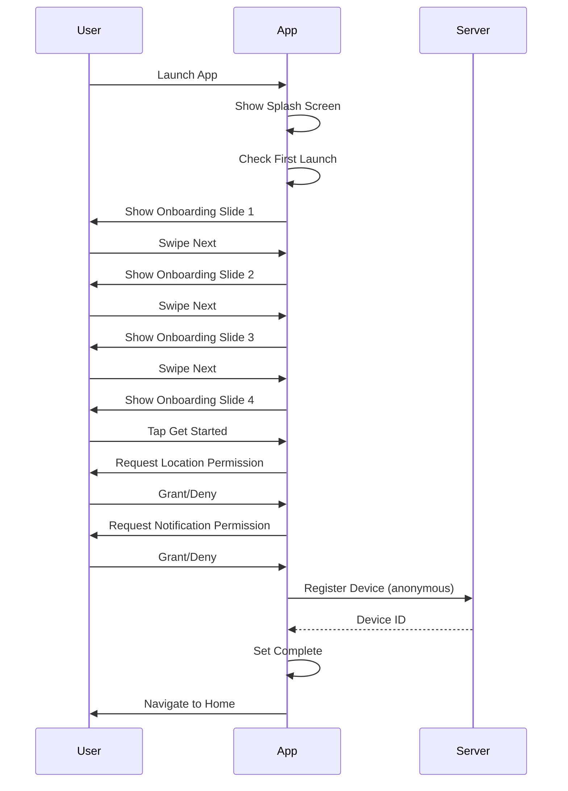

### 3.2 Search Journey Flow

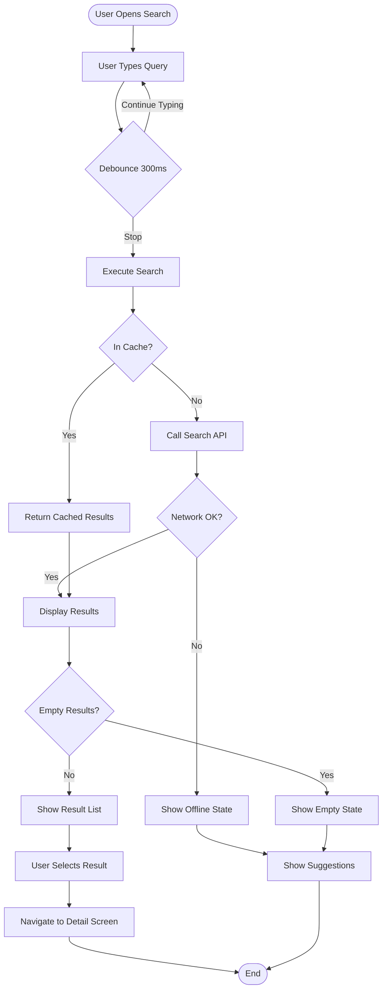

### 3.3 Budget Exploration Flow

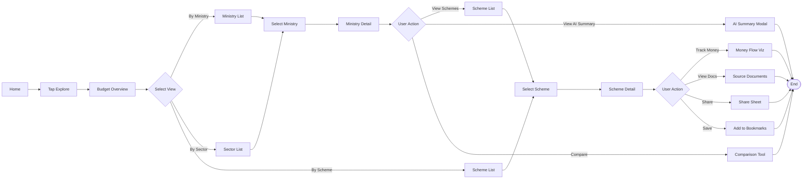

### 3.4 Offline Usage Flow

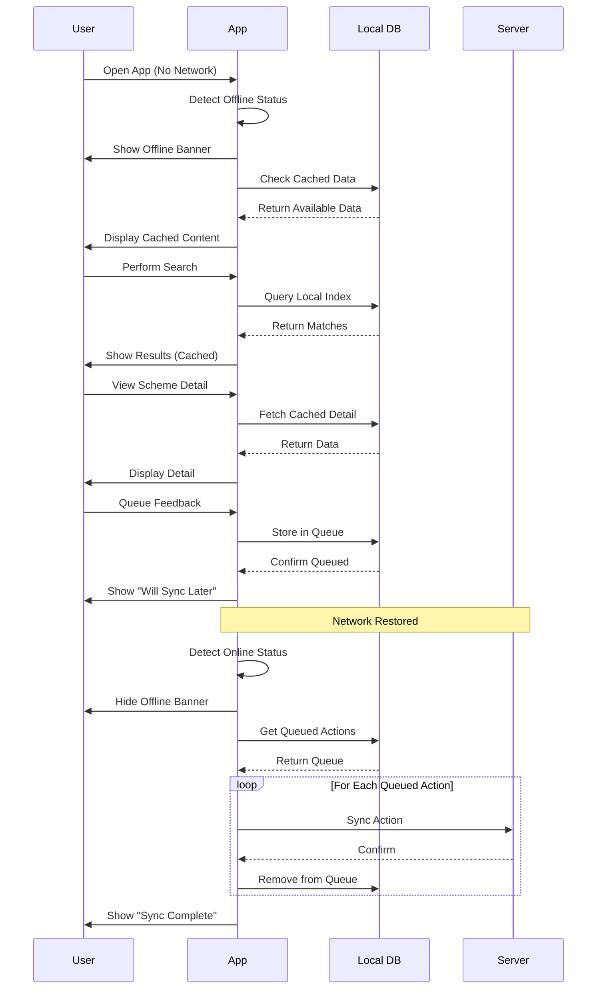

### 3.5 Language Switch Flow

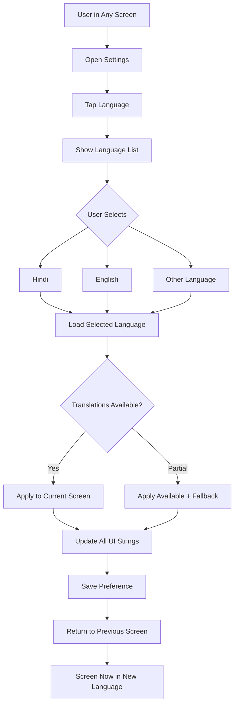

---

## 4. Component Architecture

### 4.1 Android App Component Tree

```mermaid
graph TD
    App[Application Class] --> MainActivity
    App --> AppDatabase
    App --> RepositoryContainer
    App --> DependencyInjector
    
    MainActivity --> NavHost
    MainActivity --> BottomNav
    
    NavHost --> HomeScreen
    NavHost --> ExploreScreen
    NavHost --> SearchScreen
    NavHost --> AlertsScreen
    NavHost --> SettingsScreen
    
    HomeScreen --> HomeViewModel
    HomeScreen --> ConstituencyCard
    HomeScreen --> RecentSearchesCard
    HomeScreen --> TrendingCard
    
    ExploreScreen --> ExploreViewModel
    ExploreScreen --> BudgetChart
    ExploreScreen --> MinistryList
    
    SearchScreen --> SearchViewModel
    SearchScreen --> SearchBar
    SearchScreen --> ResultList
    SearchScreen --> FilterSheet
    
    AlertsScreen --> AlertsViewModel
    AlertsScreen --> AlertList
    AlertsScreen --> AlertDetail
    
    SettingsScreen --> SettingsViewModel
    SettingsScreen --> LanguagePicker
    SettingsScreen --> LocationPicker
    SettingsScreen --> ToggleSettings
    
    RepositoryContainer --> BudgetRepository
    RepositoryContainer --> SearchRepository
    RepositoryContainer --> UserRepository
    RepositoryContainer --> SyncRepository
    
    BudgetRepository --> RemoteDataSource
    BudgetRepository --> LocalDataSource
    
    RemoteDataSource --> ApiService
    LocalDataSource --> DAO
```

### 4.2 Backend Service Architecture

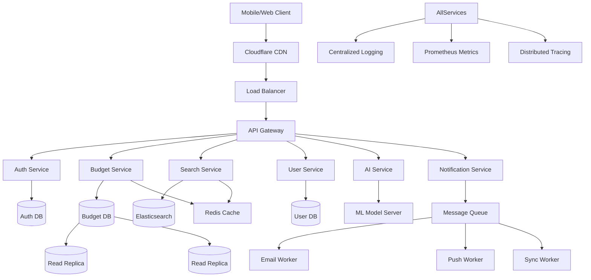

---

## 5. Data Flow Diagrams

### 5.1 Budget Data Ingestion Pipeline

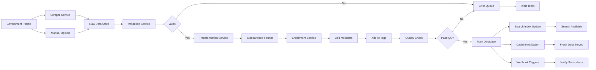

### 5.2 Search Query Flow

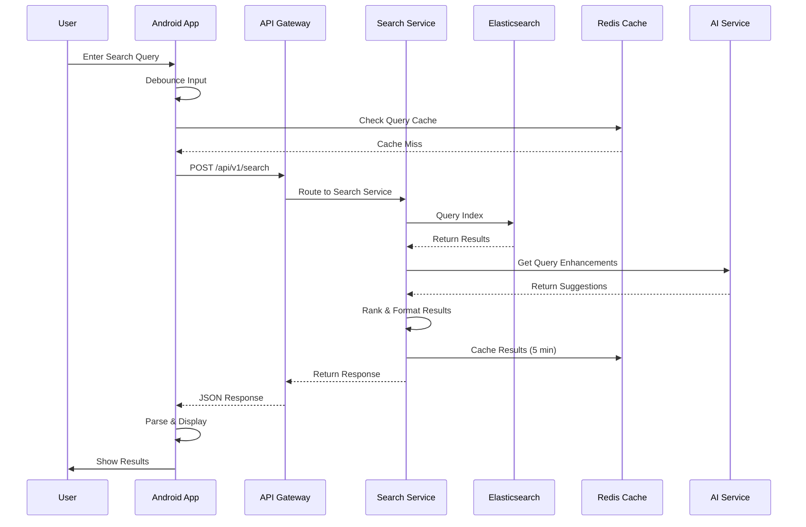

### 5.3 Offline Sync Flow

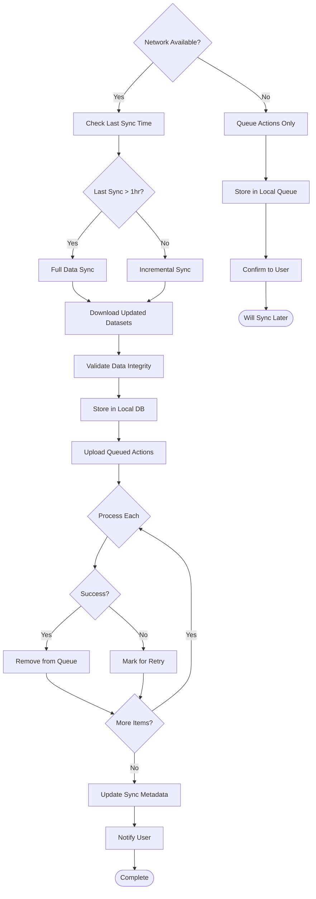

---

## 6. State Management

### 6.1 App State Machine

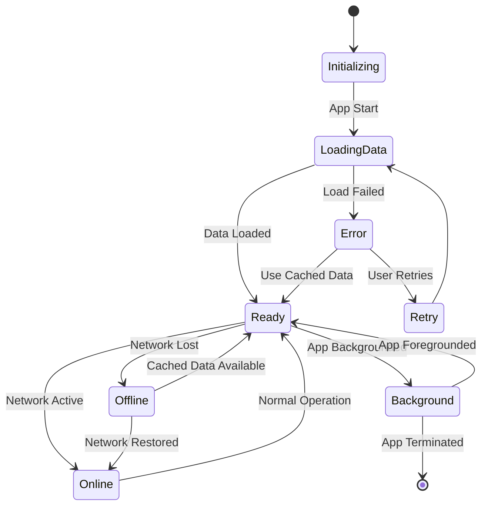

### 6.2 Sync State Machine

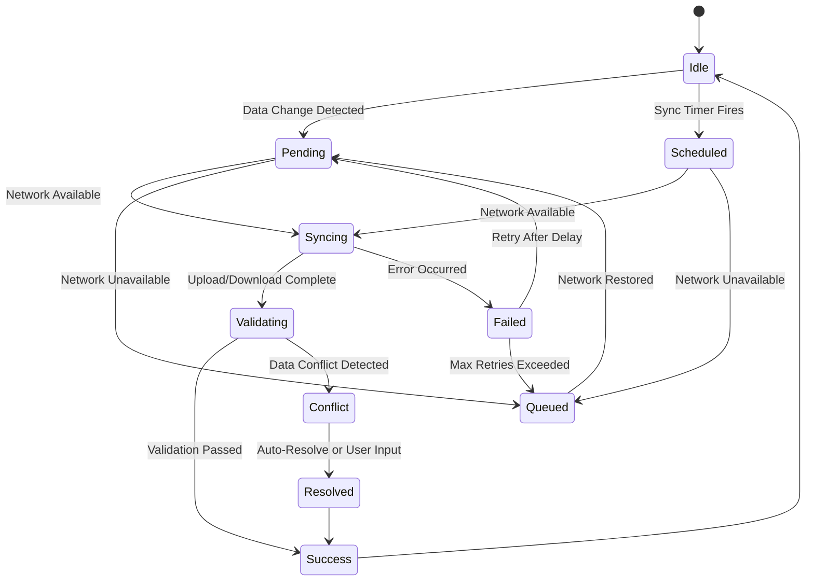

---

## 7. Navigation Graph

### 7.1 Android Navigation Graph (Jetpack Compose)

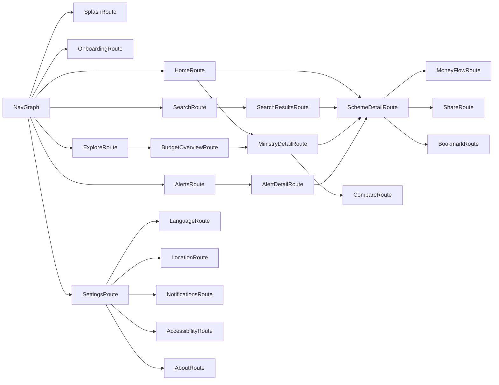

### 7.2 Deep Link Routing Table

| Pattern | Destination | Required Params | Optional Params |
|---------|-------------|-----------------|-----------------|
| `/` | Home | - | - |
| `/search` | Search | - | query, year |
| `/scheme/{id}` | SchemeDetail | scheme_id | tab |
| `/ministry/{id}` | MinistryDetail | ministry_id | year |
| `/budget/{year}` | BudgetOverview | year | view_type |
| `/moneyflow/{id}` | MoneyFlow | scheme_id | - |
| `/comparison` | Comparison | regions | year, metric |
| `/alert/{id}` | AlertDetail | alert_id | - |
| `/settings/language` | LanguageSettings | - | - |
| `/settings/location` | LocationSettings | - | - |

---

## 8. Information Taxonomy

### 8.1 Content Classification

```
Budget Data
├── By Government Level
│   ├── Union
│   ├── State (28)
│   └── UT (8)
├── By Document Type
│   ├── Budget Estimates (BE)
│   ├── Revised Estimates (RE)
│   └── Actuals
├── By Expenditure Type
│   ├── Revenue Expenditure
│   └── Capital Expenditure
├── By Sector
│   ├── Education
│   ├── Health
│   ├── Infrastructure
│   ├── Agriculture
│   ├── Defense
│   └── ... (all sectors)
└── By Geography
    ├── National
    ├── State
    ├── District
    └── Block/Panchayat

Schemes
├── Central Sector Schemes
├── Centrally Sponsored Schemes
└── State Schemes

Metadata
├── Fiscal Year
├── Ministry/Department
├── Scheme Name
├── Unique ID
├── Source Document
├── Last Updated
└── Verification Status
```

### 8.2 Tagging System

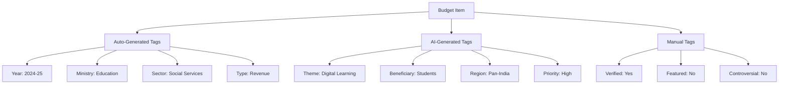

---

## 9. Accessibility Flow

### 9.1 Screen Reader Navigation

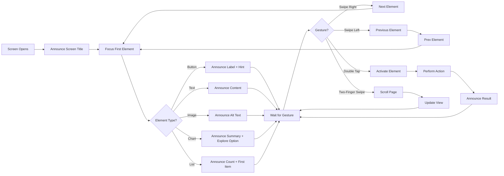

### 9.2 Reduced Motion Mode

```
Animation Policy:
├── Standard Mode
│   ├── Screen Transitions: 300ms fade + slide
│   ├── Button Press: 100ms scale
│   ├── Loading: Spinning indicator
│   └── Charts: Animated draw
└── Reduced Motion Mode
    ├── Screen Transitions: Instant cut
    ├── Button Press: Color change only
    ├── Loading: Static progress bar
    └── Charts: Instant render
```

---

## 10. Error Handling Flows

### 10.1 Error State Decision Tree

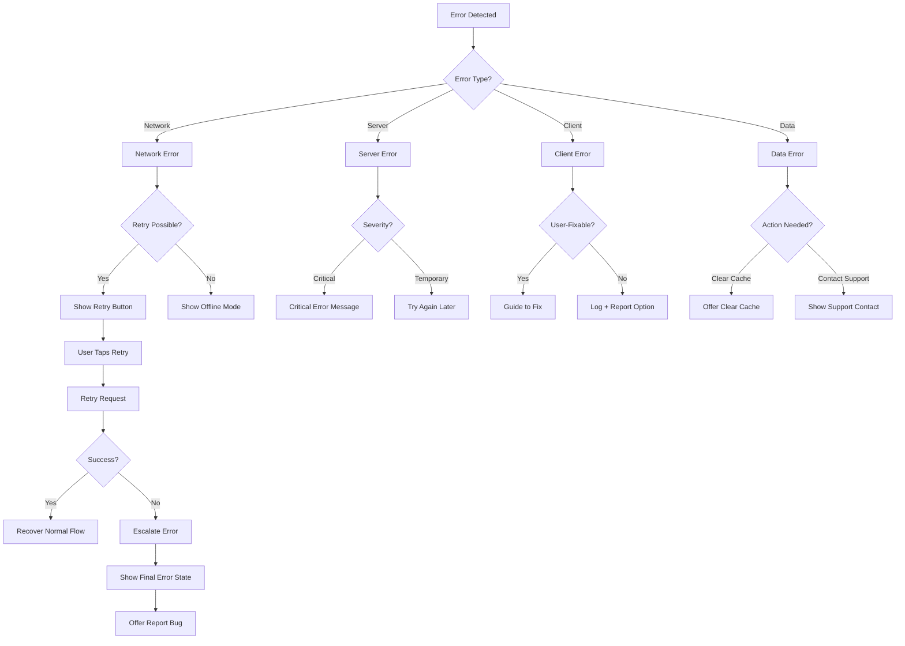

---

## 11. Performance Optimization Points

### 11.1 Lazy Loading Strategy

```
Loading Priority Levels:
├── P0 (Immediate)
│   ├── Above-fold content
│   ├── Navigation elements
│   └── Critical text
├── P1 (After Interaction Ready)
│   ├── Images below fold
│   ├── Secondary cards
│   └── Charts
├── P2 (Idle Time)
│   ├── Historical data
│   ├── Related content
│   └── Analytics
└── P3 (On Demand)
    ├── Source documents
    ├── Detailed comparisons
    └── Export functions
```

### 11.2 Caching Strategy Matrix

| Data Type | Cache Location | TTL | Invalidation Trigger |
|-----------|---------------|-----|---------------------|
| Budget Overview | Local DB + Redis | 24 hours | New budget release |
| Scheme Detail | Local DB + Redis | 7 days | Data update webhook |
| Search Results | Local DB + Redis | 5 minutes | User types new query |
| AI Summaries | Local DB + Redis | 30 days | Source data changes |
| User Preferences | Local DB only | Persistent | User updates |
| App Configuration | Local DB + CDN | 1 hour | Config change flag |
| Static Assets | Device Cache + CDN | 1 year | Version change |

---

## Appendix A: URL Routing Specification

### Web Routes

```
/                           # Landing page
/search                     # Search interface
/search?q={query}           # Pre-populated search
/budget/{year}              # Budget overview
/ministry/{slug}            # Ministry page
/scheme/{id}                # Scheme detail
/compare                    # Comparison tool
/data                       # Data explorer
/api                        # API documentation
/about                      # About page
/sources                    # Data sources
/privacy                    # Privacy policy
/terms                      # Terms of service
```

### API Routes

```
GET  /api/v1/health         # Health check
GET  /api/v1/budgets        # List budgets
GET  /api/v1/budgets/{year} # Get budget by year
GET  /api/v1/ministries     # List ministries
GET  /api/v1/ministries/{id}# Get ministry detail
GET  /api/v1/schemes        # List schemes
GET  /api/v1/schemes/{id}   # Get scheme detail
GET  /api/v1/search         # Search endpoint
POST /api/v1/feedback       # Submit feedback
GET  /api/v1/alerts         # User alerts (auth required)
POST /api/v1/alerts         # Create alert (auth required)
```

---

## Appendix B: Component Inventory

### Reusable UI Components

1. **Atoms**: Button, Input, Icon, Text, Badge, Avatar, Divider, Spacer
2. **Molecules**: SearchBar, FilterChip, ResultCard, StatCard, ChartCard, AlertItem
3. **Organisms**: Header, BottomNav, ResultList, BudgetChart, SchemeDetail, AlertList
4. **Templates**: HomePage, SearchPage, DetailPage, SettingsPage
5. **Pages**: All screens listed in Section 5

---

*This Information Architecture document is derived from PRD.md and serves as the blueprint for all Design, Android Architecture, and Backend Architecture documents. Every screen, flow, and component must align with this architecture.*
