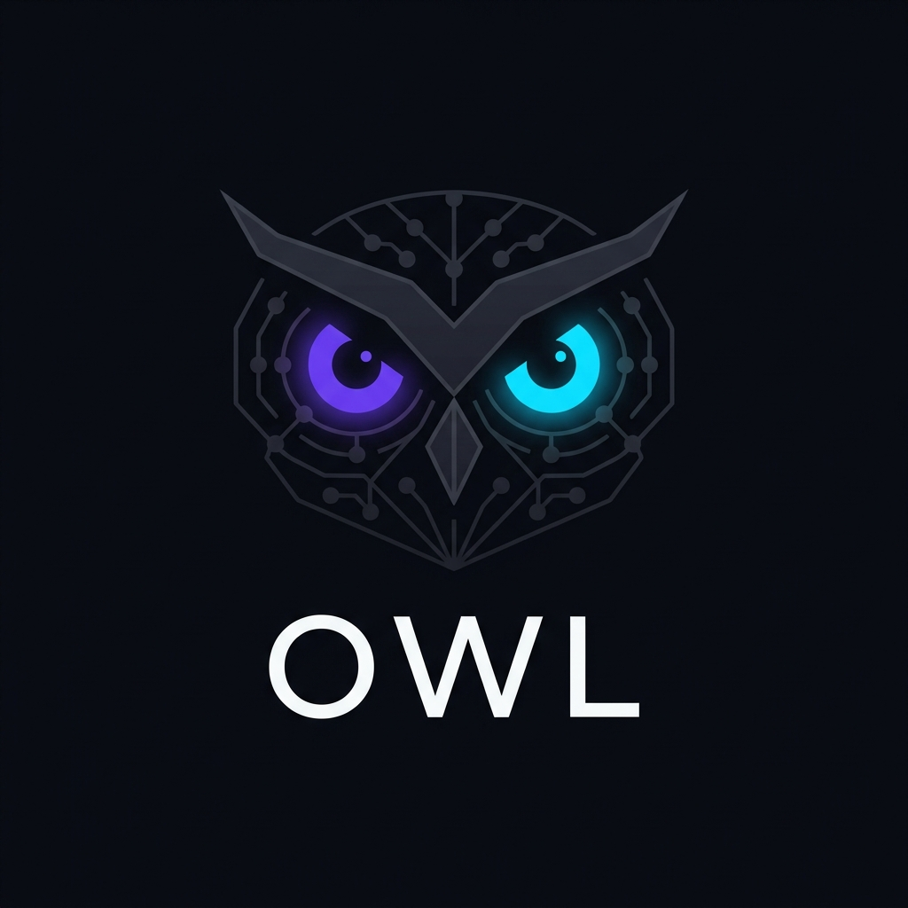
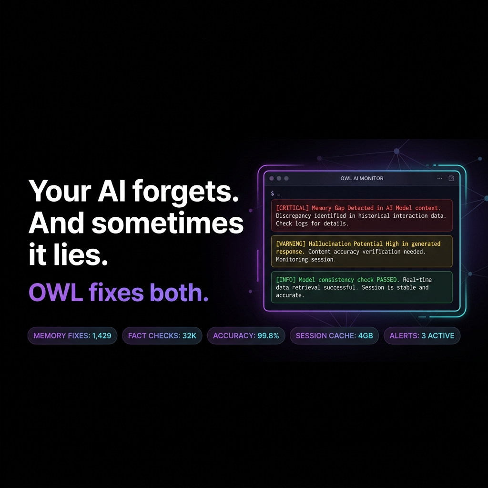

1|<p align="center">
2|  
3|</p>
4|
5|<p align="center">
6|  
7|</p>
8|
9|<p align="center">
10|  
11|  
12|  
13|  
14|  
15|</p>
16|
17|<p align="center">
18|  <strong>The local AI memory and quality substrate that reasons, verifies, and self-heals.</strong><br/>
19|  Works with <strong>Claude Desktop · Cursor · Windsurf · Antigravity</strong>
20|</p>
21|
22|---
23|
24|## Plain English: What is OWL?
25|
26|OWL is a local brain that sits behind your AI coding editor to prevent memory loss, block hallucinations, and automatically verify and repair your app code as you build.
27|
28|---
29|
30|## The Problem
31|
32|Every session, your AI starts from zero.
33|
34|It forgets the bug you debugged for 3 hours last Tuesday. It forgets your architectural decisions. It re-reads the same files and charges you for every token. And sometimes, worse, it confidently tells you something that contradicts what you told it last week.
35|
36|Tools like Mem0 and Supermemory try to fix the forgetting. They store and retrieve. That is a filing cabinet.
37|
38|**OWL is a brain.**
39|
40|---
41|
42|## What Makes OWL Different
43|
44|### 🔥 The Hallucination Firewall (Turing)
45|When your AI makes a claim, OWL cross-checks it against your stored semantic memories in real-time.
46|
47|```
48|[TURING FIREWALL CORRECTION]: Ground truth dictates "this function throws on null input."
49|Your claim contradicts this. Verify before proceeding.
50|```
51|
52|**No other memory tool does this.** Your AI can now catch itself lying.
53|
54|### 🧬 The Test Genome Engine (Hermes Pillar 1)
55|OWL treats user journeys as code DNA. It runs evolutionary cycles that mutate selectors, change inputs, and vary viewport sizes to find where your application breaks. It prunes weak or flaky tests and promotes high-performance test cases.
56|
57|### 🔧 Self-Healing Selector Infrastructure (Hermes Pillar 6)
58|If your frontend code changes and a test selector breaks, OWL does not fail immediately. It runs a semantic analysis of the page, matches candidate elements using weight scoring, and automatically corrects the broken selector inside SQLite.
59|
60|### ⚠️ Cognitive Biorhythm (Pythagoras)
61|OWL tracks which hour and day of the week you historically ship bugs. It warns you:
62|
63|```
64|⚠️ PYTHAGORAS: You are in your historical crash window (error rate 3.2x higher).
65|Defer critical deploys.
66|```
67|
68|Friday 3–5pm is hard-coded at 3.2x risk. Because the data says so.
69|
70|### 🌐 P2P Cognitive Mesh (Berners-Lee)
71|OWL runs UDP multicast discovery on your local network. When another OWL user is found on your LAN, bug patterns sync automatically. This process is completely private, anonymous, and does not expose file paths.
72|
73|---
74|
75|## The Numbers
76|
77|```
78|40-turn coding session WITHOUT OWL:
79|  Tokens: 2,050,000   Cost at $3/M: $6.15
80|
81|40-turn coding session WITH OWL:
82|  Tokens: 96,000      Cost at $3/M: $0.28
83|
84|Net savings: 95.4% reduction. Per session.
85|```
86|
87|The math: OWL loads only what is relevant. It partitions file context into active (solid), neighboring (liquid), and general project directories (gas). Distant files compress to 1% of their original size.
88|
89|---
90|
## Nine Servers. One Engineering Team.

```
owl-nexus     → Meta-orchestration (8 tools)  — Task DAGs, planning, verification
owl-code      → Code intelligence (8 tools)   — Analyze, build, test, lint, review
owl-deploy    → Infrastructure (10 tools)     — Docker, K8s, CI/CD
owl-data      → Data operations (8 tools)     — SQL, schema, CSV, ETL
owl-web       → Web intelligence (11 tools)   — Scraping, stealth, monitoring
owl-research  → Deep research (10 tools)      — Multi-query synthesis
owl-qa        → Quality assurance (24 tools)  — E2E, visual, performance
owl-memory    → Memory management (8 tools)   — Episodic, semantic, vector
creative-studio → Creative writing (10 tools) — Stories, scoring, pacing
```

All servers run as stdio MCP servers managed by Hermes Agent. Phase 2 servers (nexus, code, deploy, data) form the engineering team. See PHASE2.md for details.
113|
114|---
115|
116|## The 12 Innovation Pillars of Hermes v8.0
117|
118|| Pillar | System Module | Core Capability |
119|| :--- | :--- | :--- |
120|| **1. Test Genome** | `owl_qa_genome.py` | Breeds elite test flows, mutates inputs/viewports, and prunes flaky tests. |
121|| **2. Causal AI** | `owl_qa_causal.py` | Traces observed bugs to source causes and generates simplified explanations. |
122|| **3. Bug Oracle** | `owl_qa_oracle.py` | Analyzes code diffs, forecasts regression risk, and configures monitors. |
123|| **4. Sensory Testing** | `owl_qa_sensory.py` | Audits media playback, checks animation frames, and throttles network speeds. |
124|| **5. Device Cloud** | `owl_qa_device_cloud.py` | Discovers Android ADB units and runs test pipelines in parallel. |
125|| **6. Selector Healing** | `owl_qa_healer.py` | Diagnoses broken DOM selectors and repairs them in SQLite. |
126|| **7. Bug Economics** | `owl_qa_economics.py` | Assigns financial debt weights to bugs based on impact and fix difficulty. |
127|| **8. Living Graph** | `owl_qa_graph.py` | Clusters defects using NetworkX and calculates code blast radii. |
128|| **9. Mirror Test** | `owl_qa_selftest.py` | Self-diagnostic testing of local SQLite, browsers, ports, and daemons. |
129|| **10. Temporal Velocity** | `owl_qa_temporal.py` | Calculates test quality velocity and pinpoints regression events. |
130|| **11. App Connectors** | `owl_qa_protocol.py` | Tests contracts on WebSockets, GraphQL endpoints, and gRPC methods. |
131|| **12. Neural Mesh** | `owl_qa_orchestrator.py` | Manages the background event bus and serves diagnostic status on port 7700. |
132|
133|---
134|
135|## Complete Tool Suite (105 Tools)
136|
137|### 🧠 owl-memory — Neuromorphic Engine (55+ tools)
138|- **6 Memory Types**: Episodic, Semantic, Procedural, Somatic, Transactive, and Working memory.
139|- **Einstein Relativistic Gravity**: Ranks relevant records by call-graph distance and emotional importance.
140|- **Tesla Resonance**: Propagates context weight across code networks.
141|- **Thiel Contradiction Detector**: Flags discrepancies between code comments and database records.
142|- **Tata Stewardship**: Tracks package crash histories and inserts circuit breakers.
143|
144|### 🔍 owl-research — Search Engine (9 tools)
145|- `research_quick`: High-speed web query under 5 seconds.
146|- `research_deep`: Parallel multi-query synthesis.
147|- `research_compare`: Compares up to 4 topics side-by-side.
148|- `extract_article`: Captures full article text from a URL.
149|- `research_first_principles`: Decomposes topics into axioms and constraints.
150|
151|### 🌐 owl-web — Web Intelligence (10 tools)
152|- `web_fetch`: Standard static webpage retrieval.
153|- `web_fetch_stealthy`: Cloudflare bypass for protected portals.
154|- `web_fetch_dynamic`: JavaScript page execution.
155|- `web_scrape_adaptive`: Extracts targets even after site layout changes.
156|- `web_diff`: Maps change diffs between page snapshots.
157|
158|### 🧪 owl-qa — Quality Assurance (31 tools)
159|- `qa_inspect_web`: Analyzes layout elements, console outputs, and visual score metrics.
160|- `qa_android_inspect`: Captures Android screenshots and UI hierarchy.
161|- `qa_api_inspect`: Exercises endpoints against common edge cases.
162|- `qa_interact_web`: Performs sequence steps on a target website.
163|- `qa_android_interact`: Automates taps and keystrokes on connected Android units.
164|- `qa_test_flow`: Auto-runs user flows with AI-generated navigation helpers.
165|- `qa_regression_check`: Validates performance and layout shifts against baseline records.
166|- `qa_sherlock`: Recreates bugs by systematically changing inputs and screen sizes.
167|- `qa_accessibility_audit`: Evaluates WCAG compliance.
168|- `qa_performance_probe`: Validates Web Vitals and detects memory leaks.
169|- `qa_chaos_probe`: Injects failures (Offline, Slow 3G) during test flows.
170|- `qa_harmonic_audit`: Verifies visual page grids.
171|- `qa_sentinel_register`: Commits a workflow to the 24/7 background monitor list.
172|- `qa_explain_bug`: Explains bugs in plain language tailored to the audience.
173|- `qa_predict_bugs`: Scans code diffs to warn about high-risk changes.
174|- `qa_sensory_audit`: Measures playback audio/video states and frame rates.
175|- `qa_economics_report`: Outlines bug priority based on technical debt cost.
176|- `qa_knowledge_graph`: Connects and draws test results in a network structure.
177|- `qa_temporal_analysis`: Tracks change speed and regression patterns.
178|- `qa_protocol_test`: Connects and tests GraphQL, WebSocket, or gRPC methods.
179|- `qa_compare_apps`: Runs a test flow on staging and production side-by-side.
180|- `qa_load_test`: Spins up to 25 parallel browser workflows to test server load.
181|- `qa_user_story_generate`: Translates user stories into step-by-step test commands.
182|- `qa_competitive_audit`: Runs audits on your site and a competitor's site.
183|- `qa_genome_evolve`: Evaluates and mutates the current test pool.
184|- `qa_genome_register_flow`: Saves a new workflow inside the evolutionary pool.
185|- `qa_causal_chain`: Pinpoints root causes of errors.
186|- `qa_device_cloud_scan`: Auto-discovers active USB/WiFi Android devices.
187|- `qa_device_parallel_test`: Dispatches a mobile test to multiple Android units at once.
188|- `qa_selftest`: Performs a full diagnostic check on OWL QA.
189|- `qa_orchestrator_status`: Reviews the health status of all 12 pillars.
190|
191|---
192|
193|## Installation
194|
195|### Prerequisites
196|- Node.js v18+
197|- Python 3.10+
198|
## Phase 2: Engineering Team

### 🎯 owl-nexus — Meta-Orchestration (8 tools)
Task DAG decomposition, parallel execution, verification loops, workflow templates.

### 💻 owl-code — Code Intelligence (8 tools)
Analyze, build, test, lint, execute, review, refactor, explain. Auto-detects language and tools.

### 🚀 owl-deploy — Infrastructure (10 tools)
Dockerfile, docker-compose, K8s manifests, CI/CD config, infrastructure scanning.

### 📊 owl-data — Data Operations (8 tools)
SQL execute/migrate, schema design, CSV import/export, database inspection, ETL planning.
199|### Setup
200|```bash
201|git clone https://github.com/gauravv-g/owl-memory-mcp.git
202|cd owl-memory-mcp
203|npm install
204|pip install starlette uvicorn sse-starlette mcp scrapling beautifulsoup4 lxml html2text duckduckgo-search newspaper3k lxml_html_clean playwright uiautomator2 pillow anthropic aiohttp networkx
205|playwright install
206|```
207|
208|---
209|
## Running the Subsystem

All servers run as stdio MCP servers managed by Hermes Agent.
They are registered in `~/.hermes/config.yaml` and auto-started by Hermes.

```bash
hermes mcp list          # List all servers
hermes mcp test <name>   # Test a server connection
```

## License
MIT.