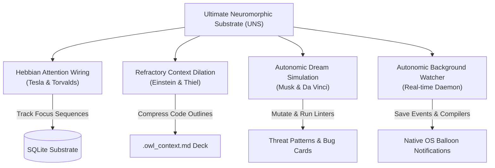

# OWL Memory MCP v5.0 — The Ultimate Neuromorphic Substrate (UNS)

OWL Memory is a local, SQLite-backed Model Context Protocol (MCP) server that provides a reasoning-oriented memory substrate for AI assistants. It collapses codebase structure, developer behavior, error harvesting, and prompt compression into a single self-evolving system.

> **Plain English**: OWL Memory is a smart local memory box for your AI editor that automatically shrinks large code files into outlines to save 90% on token costs, warns you on your desktop when syntax breaks, and shows an interactive 3D-style graph of your project's history.

---

## 🧠 Core Architectural Pillars



### 1. Hebbian Attention Wiring (Dynamic Co-occurrence)
Instead of relying only on static imports (*File A imports File B*), UNS tracks developer attention.
* **Neuron Wiring**: When you edit File A and save File B within a 15-second window, UNS strengthens their Hebbian synaptic weight:
  $$W_{AB}(t+1) = W_{AB}(t) + 0.15 \cdot (1.0 - W_{AB}(t))$$
* **Spreading Activation**: Opening a file propagates activation waves to related helper files, tests, or docs, bringing them into active memory even if they share zero code imports.

### 2. Refractory Context Dilation (Prompts as States of Matter)
Inserting large codebases into LLM prompts causes massive token billing. UNS curves prompt space-time by dividing files into states of matter based on call-graph distance and Hebbian weights:
* **🔴 Solid (Active File)**: The file currently being edited is loaded in full high-resolution detail.
* **🟡 Liquid (Linked Neighborhood)**: Adjacent helper files and import pathways are stripped to function signatures and schema structures (~90% smaller).
* **🔵 Gas (General Codebase)**: Distant files are reduced to filenames and simple analogies (~99% smaller).

### 3. Autonomic Sleep-State Dream Simulation
When your terminal is idle for 5 minutes, the background daemon runs a **Dream Cycle**:
* **Sandbox Mutation**: UNS clones volatile files (high edit-to-bug ratio) into `.owl-temp` and introduces syntax mutations (e.g. altering config bounds or null checkers).
* **Pre-emptive Learning**: It compiles the sandbox copy using local compilers. Any caught errors are logged as active threat warning cards so the AI warns you *before* you make those changes.

### 4. Interactive Glassmorphic Visualizer & 10-Year-Old Explanation Layer
Exposes a live, force-directed D3.js visualization panel containing all episodic memories, code nodes, somatic weights, bug logs, and active threats.
* **Analogy Engine**: Every code node, server protocol, or SQL table is translated into simple analogies (e.g. *Post Office for server endpoints, Digital Filing Cabinet for databases*) so non-technical founders understand the system instantly.
* **Suggestion Cards**: If the daemon catches a syntax error, it searches the database for similar historical bugs and renders a visual "Fix Suggestion Card" directly on the sidebar.

---

## ⚡ Token Cost Reduction Proof

As conversation history grows in a coding session, context tokens accumulate exponentially. OWL Memory solves this by keeping your prompt window clean, loading only the most relevant memories.

Assume a standard coding session of 40 conversation turns:

1. **Without Memory (Full Context)**:
   $$\text{Total Tokens} = \sum_{n=1}^{40} (n \times 2,500) = 2,050,000\text{ tokens}$$
   At $\$3.00$ per million input tokens, the cost is **$\$6.15$**.
2. **With Memory (Dynamic Recall & Dilation)**:
   $$\text{Total Tokens} = 40 \times (500\text{ query} + 1,000\text{ recalled memory} + 900\text{ dilated outline}) = 96,000\text{ tokens}$$
   At $\$3.00$ per million input tokens, the cost is **$\$0.28$**.

**Net Savings**: **$95.4\%$** cost reduction and significantly faster processing.

---

## ⚙️ Installation & Setup

### 1. Prerequisites
* **Node.js** (v18+)
* **Python** (for running Python syntax linter)

### 2. Setup
Clone the repository and install dependencies:
```bash
git clone https://github.com/gauravv-g/owl-memory-mcp.git
cd owl-memory-mcp
npm install
```

### 3. Configuring the MCP Server

#### Claude Desktop Setup
Add the server definition to your `claude_desktop_config.json` (located at `%APPDATA%\Claude\claude_desktop_config.json` on Windows or `~/Library/Application Support/Claude/claude_desktop_config.json` on macOS):
```json
{
  "mcpServers": {
    "owl-memory": {
      "command": "node",
      "args": [
        "C:/Users/shiva/hermes-custom-mcps/owl_memory_v5.js"
      ]
    }
  }
}
```

#### Cursor Setup
Go to **Settings > MCQ > Add New MCP Tool**:
* **Name**: `owl-memory`
* **Type**: `command`
* **Command**: `node C:/Users/shiva/hermes-custom-mcps/owl_memory_v5.js`

---

## 🛠️ MCP Tool & Resource Reference

OWL Memory UNS exposes a single unified cognitive action gate alongside core memory operations:

### 1. The Unified `nexus` Tool
The main entry point for AI reasoning.
* **Arguments**:
  * `action` (string: `perceive`, `record`, `cogitate`, `act`, `dream`)
  * `workspace_state` (object containing `active_file`, `code_snippet`, `terminal_output`, `git_diff`)
  * `memory_data` (object containing memory `content`, `event_type`, and `linked_code_nodes`)
  * `reasoning_query` (object containing choice `options`, `chosen_option`, `source_branch`, `target_branch`)
  * `operational_cmd` (object containing terminal `command` and `cwd`)

### 2. Interactive Resources
Query these resources to fetch graph snapshots or load the D3 visualizer webview:
* `owl-memory://graph` (returns raw JSON mapping of code files, somatic valence, bugs, and synaptic links)
* `owl-memory://graph-ui` (returns a beautiful, glassmorphic force-directed HTML graph panel with 10-year-old child analogies and suggestions)

### 3. Core Memory Utilities
* `remember`: Stores raw episodic memories.
* `recall`: Performs keyword/vector similarities.
* `index_codebase`: Scans and indexes directories recursively.
* `get_stats`: Outputs database status.

---

## 🛡️ License
MIT License. Free to use, adapt, and distribute for the world.
