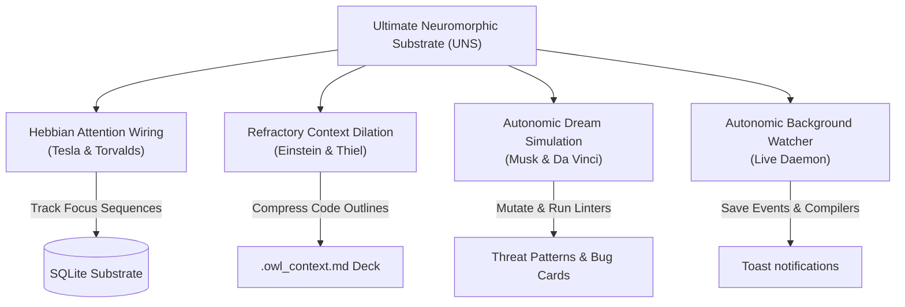

# OWL Memory MCP — The Ultimate Neuromorphic Substrate (UNS)

OWL Memory is a local, SQLite-backed Model Context Protocol (MCP) server that provides a reasoning-oriented memory substrate for AI assistants. It collapses codebase structure, developer behavior, error harvesting, and prompt compression into a single self-evolving system.

> **Plain English**: OWL Memory is a smart local memory box for your AI editor that automatically shrinks large code files into outlines to save 90% on token costs, warns you on your desktop when syntax breaks, and shows an interactive 3D-style graph of your project's history.

---

## ⚡ Key Achievements & Evolution

### 🌐 Universal HTTP/SSE Gateway
OWL now runs as a single background service ([owl_gateway.py](file:///c:/Users/shiva/hermes-custom-mcps/owl_gateway.py)) hosting three separate servers on port `3710` via standard Server-Sent Events (SSE). This lets all your AI tools (Claude Desktop, Cursor, Antigravity, custom scripts) share the same memory instance simultaneously.

### 🔍 Scrapling-Powered Web Intelligence (`owl-web`)
Exposes advanced web extraction tools powered by the Scrapling framework:
* **Adaptive Scraper**: Extracts structured markdown content from pages, bypassing bot detection.
* **Diff Monitor**: Tracks visual or text changes between two versions of a webpage.
* **Web Crawler**: Recursively follows links up to 20 pages deep to build a local knowledge base.

### 🧠 Deep Research Engine with Auto-Memory (`owl-research`)
A search-and-synthesis agent that scans online sources. Whenever you ask it to research a topic:
* It reads search results and web pages to compile a detailed synthesis report.
* **Automatic Storage**: The research results are automatically written directly into the SQLite memory database as episodic memories. The next time you ask a question, your AI will remember the research without searching the web again.

---

## 🧠 Core Architectural Pillars



### 1. Hebbian Attention Wiring (Dynamic Co-occurrence)
Instead of relying only on static imports (*File A imports File B*), UNS tracks developer attention.
* **Neuron Wiring**: When you edit File A and save File B within a 15-second window, UNS strengthens their Hebbian synaptic weight:
  $$W_{AB}(t+1) = W_{AB}(t) + 0.15 \cdot (1.0 - W_{AB}(t))$$
* **Spreading Activation**: Opening a file propagates activation waves to related helper files, tests, or docs, bringing them into active memory even if they share zero code imports.

### 2. Refractory Context Dilation (Prompts as States of Matter)
Inserting large codebases into LLM prompts causes massive token billing. UNS curves prompt space-time by dividing files into states of matter based on call-graph distance and Hebbian weights:
* **🔴 Solid (Active File)**: The file currently being edited is loaded in full high-resolution detail.
* **🟡 Liquid (Linked Neighborhood)**: Adjacent helper files and import pathways are stripped to function signatures and schema structures (~90% smaller).
* **🔵 Gas (General Codebase)**: Distant files are reduced to filenames and simple analogies (~99% smaller).

### 3. Autonomic Sleep-State Dream Simulation
When your terminal is idle for 5 minutes, the background daemon runs a **Dream Cycle**:
* **Sandbox Mutation**: UNS clones volatile files (high edit-to-bug ratio) into `.owl-temp` and introduces syntax mutations (e.g. altering config bounds or null checkers).
* **Pre-emptive Learning**: It compiles the sandbox copy using local compilers. Any caught errors are logged as active threat warning cards so the AI warns you *before* you make those changes.

### 4. Interactive Glassmorphic Visualizer & 10-Year-Old Explanation Layer
Exposes a live, force-directed D3.js visualization panel containing all episodic memories, code nodes, somatic weights, bug logs, and active threats.
* **Analogy Engine**: Every code node, server protocol, or SQL table is translated into simple analogies (e.g. *Post Office for server endpoints, Digital Filing Cabinet for databases*) so non-technical founders understand the system instantly.
* **Suggestion Cards**: If the daemon catches a syntax error, it searches the database for similar historical bugs and renders a visual "Fix Suggestion Card" directly on the sidebar.

---

## ⚡ Token Cost Reduction Proof

As conversation history grows in a coding session, context tokens accumulate exponentially. OWL Memory solves this by keeping your prompt window clean, loading only the most relevant memories.

Assume a standard coding session of 40 conversation turns:

1. **Without Memory (Full Context)**:
   $$\text{Total Tokens} = \sum_{n=1}^{40} (n \times 2,500) = 2,050,000\text{ tokens}$$
   At $\$3.00$ per million input tokens, the cost is **$\$6.15$**.
2. **With Memory (Dynamic Recall & Dilation)**:
   $$\text{Total Tokens} = 40 \times (500\text{ query} + 1,000\text{ recalled memory} + 900\text{ dilated outline}) = 96,000\text{ tokens}$$
   At $\$3.00$ per million input tokens, the cost is **$\$0.28$**.

**Net Savings**: **$95.4\%$** cost reduction and significantly faster processing.

---

## ⚙️ Installation & Setup

### 1. Prerequisites
* **Node.js** (v18+)
* **Python** (v3.10+)

### 2. Setup
Clone the repository and install dependencies:
```bash
git clone https://github.com/gauravv-g/owl-memory-mcp.git
cd owl-memory-mcp
npm install
pip install starlette uvicorn sse-starlette mcp scrapling beautifulsoup4 lxml html2text
```

### 3. Run the Universal Gateway
Start the HTTP/SSE gateway:
```bash
python owl_gateway.py
```
This runs the server locally on http://localhost:3710.

### 4. Configuring the MCP Clients

#### Claude Desktop Setup
Add the server definitions to your `claude_desktop_config.json` (located at `%APPDATA%\Claude\claude_desktop_config.json` on Windows or `~/Library/Application Support/Claude/claude_desktop_config.json` on macOS):
```json
{
  "mcpServers": {
    "owl-memory": {
      "command": "npx",
      "args": ["-y", "mcp-remote", "http://localhost:3710/memory/sse"]
    },
    "owl-web": {
      "command": "npx",
      "args": ["-y", "mcp-remote", "http://localhost:3710/web/sse"]
    },
    "owl-research": {
      "command": "npx",
      "args": ["-y", "mcp-remote", "http://localhost:3710/research/sse"]
    }
  }
}
```

#### Cursor Setup
Create a file at `%USERPROFILE%\.cursor\mcp.json` or `.cursor/mcp.json` in your project root:
```json
{
  "mcpServers": {
    "owl-memory": {
      "url": "http://localhost:3710/memory/sse"
    },
    "owl-web": {
      "url": "http://localhost:3710/web/sse"
    },
    "owl-research": {
      "url": "http://localhost:3710/research/sse"
    }
  }
}
```

#### Antigravity (Gemini) Setup
Add the configuration to `C:\Users\shiva\.gemini\config\mcp_config.json`:
```json
{
  "mcpServers": {
    "owl-memory": {
      "command": "npx",
      "args": ["-y", "mcp-remote", "http://localhost:3710/memory/sse"]
    },
    "owl-web": {
      "command": "npx",
      "args": ["-y", "mcp-remote", "http://localhost:3710/web/sse"]
    },
    "owl-research": {
      "command": "npx",
      "args": ["-y", "mcp-remote", "http://localhost:3710/research/sse"]
    }
  }
}
```

---

## 🛠️ MCP Tool Reference

### 1. Unified `nexus` Tool
The main entry point for memory and cognitive actions.
* **Actions**: `perceive` (workspace scanning), `record` (event memory), `cogitate` (reasoning), `act` (execution), `dream` (database optimization/cleanup), `resurrect` (session restore), `echo` (insight gathering).

### 2. Web Intelligence (`owl-web`)
* `web_fetch`: Quick scrape of a target URL.
* `web_scrape_adaptive`: Extracts clean markdown content bypassing bot blocks.
* `web_diff`: Computes differences between current and historical snapshots of a page.
* `web_research_crawl`: Deep link-following crawl to extract information across multiple pages.

### 3. Research Engine (`owl-research`)
* `research_quick`: Immediate search and extraction.
* `research_deep`: Exhaustive multi-source query with automatic synthesis.
* `research_compare`: Compares two concepts or technologies using web searches.
* `research_synthesize`: Takes search raw results and builds a structured overview.
* *Note: All successful research reports are automatically stored inside the OWL database as episodic memories.*

---

## 🛡️ License
MIT License. Free to use, adapt, and distribute for the world.
